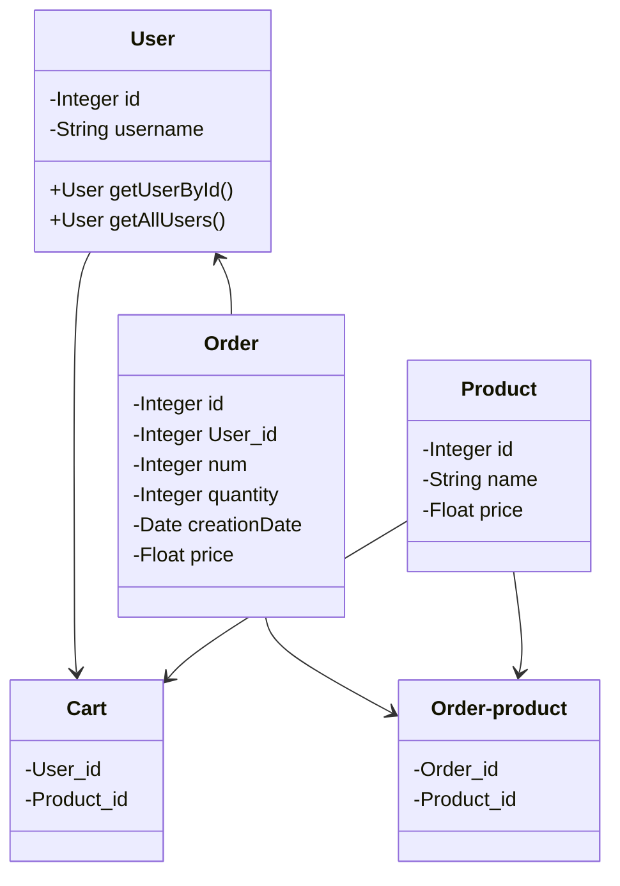

# Shop Springboot

## Installation
#ouvrir api-java 
./ gradlew bootrun

### Understanding the class diagram :

```mermaid
classDiagram
    
    Order --> Order-product
    Product --> Order-product
    User --> Cart
    Product --> Cart
    User <-- Order
    
    Product
    
    class User {
      -Integer id
      -String username
      +User getUserById()
      +User getAllUsers()
    }
    class Product {
        -Integer id
        -String name
        -Float price
    }
    class Cart {
        -User_id
        -Product_id
    }
    class Order-product {
        -Order_id
        -Product_id
    }
    class Order {
        -Integer id
        -Integer User_id
        -Integer num
        -Integer quantity
        -Date creationDate
        -Float price
    }
```